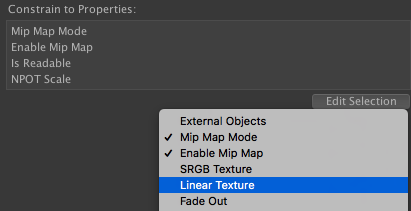
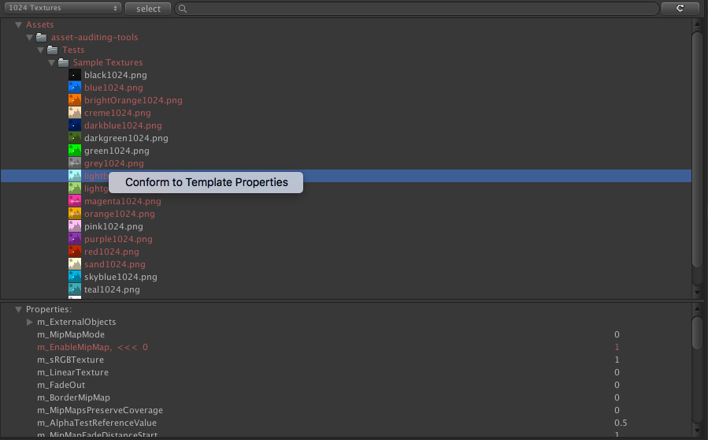

# Asset Auditor tool

### Requires Unity 2017+

Use this tool to audit assets within your project and ensure Assets have the correct properties. It can be dropped into any Unity project with a version of 2017.1 or greater. It will create a new menu item in __Window__ > __Asset Auditor__.

This window provides an explorer like interface to managing and modifying assets in your project. When first opened, it may look empty. First you must create a Profile to view in the window.

# Usage

## Profile's

Create a new Profile within the Project window context menu __Create__ > __Asset Tools__ > __New Profile__.

#### Template:

The Template can be any Unity Object. This determines what Properties can be applied to Assets. Only Assets that match the Template Object type will match the filter.

__Supported Templates:__
* Texture
* Model
* Audio

#### Search Filter's:

Click Add to add a new search filter to the filters list. Press the right button with "-" to remove one.
All filters must evaluate to true for an Asset to match search conditions.

Filter Target, Indicates what you want to search on:
* *Filename* - Just the full filepath filename and Extension.
* *FullFilename* - Includes the Filename, Folder Path and the extension.
* *FolderName* - Just the folder that contains the Asset.
* *Directory* - The full Folder Path to the Asset (Not including the Asset).
* *Extension* - Just the extension of the Asset.
* *AssetBundle* - The AssetBundle name the Asset is assigned to.
* *FileSize* - The size on disk of the Asset (Not imported size).
* *Labels* - Labels assigned to the Asset.

Filter Condition, Indicates how you want to see if the Target is a match:
* *Contains* - Target can contain the wildcard anywhere.
* *Equals* - Target must match the wildcard precisely.
* *Regex* - Use a Regular Expression as the wildcard.
* *DoesNotContain* - Target cannot contain the wildcard string.
* *StartsWith* - Target starts with the wildcard.
* *EndsWith* - Target ends with the wildcard.
* *GreaterThan* - Used when Target is a number, true when greater than the wildcard.
* *GreaterThanEqual* - Used when Target is a number, true when greater than or equal to the wildcard.
* *LessThan* - Used when Target is a number, true when less than the wildcard.
* *LessThanEqual* - Used when Target is a number, true when less than or equal to the wildcard.

Wildcard string: This is the value to Filter against.

#### Constrain to Propertie's:

Click on __"Edit Selection"__ to open a drop down list containing properties available for importing Assets associated with the Template.

## Fixing Asset's

Assets that do not conform to the Template properties are displayed with a red font.

Right clicking on an Asset that does not conform to list options to fix the Asset.

#### TODO Tasks
* Multi-Select of Asset files
* Selecting a folder lists Assets under
* Work with NativeFormatImporter types
* Allow specification of post/pre processor methods to use on asset
* Add labels as a search option
  Add user-data as a feature?
      if this is valid, then would be good to have contain to properties as a reverse so can easily disable user-data
      or automatically ignore user-data
 * Implement TestRunner tests